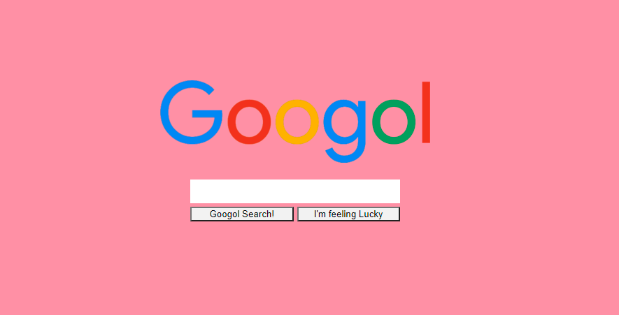

# Googol, our Google

## Creating a client search webpage and an engine that fetches data from an API
---
### Content of this repository

The index.html file that renders the webpage is placed at the forefront of the repository and linked to the ```client folder```.

The ```client folder``` contains:
1. ```mystyle.css```, the styling file for the HTML page
2. ```script.js```, a scripting file with the instructions to respond to the client search

The ```server``` folder contains:
1. ```server.js```, in which a server is instantiated
2. ```index.js``, in which the server is launched at port 3000

The ```test``` folder contains:
1. ```api.spec.js```, to test the API GET responses
2. ```html.spec.js```, to test the client webpage content  

### Useful commands

**Set up**
+ clone the repo
+ Enter the directory with ```cd google-challenge```
+ Install the necessary dependencies with ```npm i```

**Run**
+ use ```npm run start``` to lauch the server 
+ use ```http-server``` to launch the client site   
or
+ use ```npm t``` to run the test suite


A screenshot of the search bar      
### Notes
**Googol Search!**
+ The search is restricted to "fruit" and "meat", for which it returns a number of results.
+ The search returns an error if the client searches for any other item 
+ The search returns no results for empty string searches

**I'm feeling Lucky**
+ The search returns one result only.
